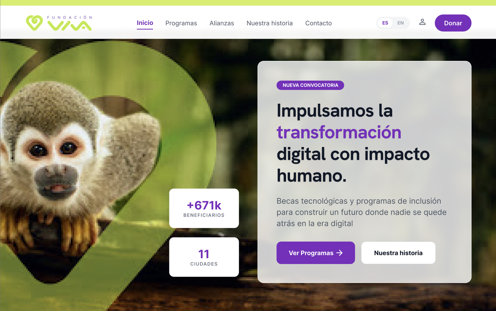
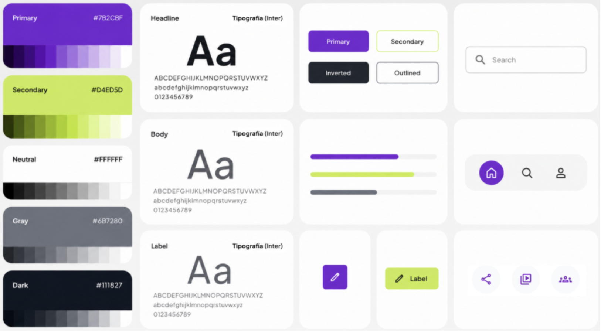
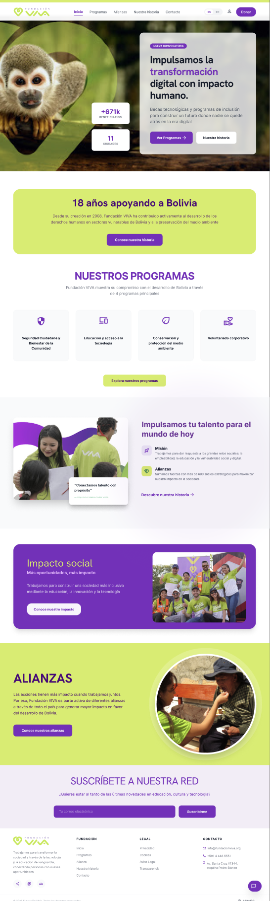

# 💜 Rediseño UX/UI – Fundación VIVA

## 📖 Descripción

Este proyecto consiste en el rediseño de la experiencia e interfaz de usuario (UX/UI) del sitio web de Fundación VIVA, desarrollado como proyecto final del Diplomado en Diseño UX/UI de la Universidad para el Desarrollo y la Innovación (UDI).

El objetivo fue mejorar la navegación, accesibilidad y experiencia de usuario mediante una metodología centrada en las personas, creando una interfaz moderna, intuitiva y alineada con la identidad visual de la fundación.

---

## 🎯 Objetivos

- Mejorar la experiencia de navegación.
- Facilitar el acceso a los programas y proyectos sociales.
- Optimizar la arquitectura de información.
- Modernizar la identidad visual.
- Incrementar la accesibilidad y usabilidad.

---

## 🛠 Herramientas

- Figma
- Design Thinking
- UX Research
- Wireframing
- Prototipado
- Design System
- Atomic Design
- Pruebas de Usabilidad

---

## 📋 Proceso de Diseño

### 1. Investigación

- Benchmarking
- Análisis de competidores
- Identificación de oportunidades

### 2. Arquitectura de Información

- Organización del contenido
- Definición de la navegación
- Jerarquización de información

### 3. Wireframes

Diseño de la estructura de cada pantalla priorizando la experiencia del usuario.

---

### 4. Sistema de Diseño

Se desarrolló un Design System que incluye:

- Paleta de colores
- Tipografía
- Componentes reutilizables
- Botones
- Cards
- Navbar
- Footer
- Iconografía

---

### 5. Mockups

Diseño de interfaces de alta fidelidad siguiendo principios de UX/UI y diseño responsivo.

---

### 6. Prototipo Interactivo

Creación de un prototipo navegable en Figma para validar la experiencia del usuario.

🔗 **Ver Prototipo**

https://www.figma.com/design/UfCpVMiMiLY7nouCd5hnPw/Redise%C3%B1o-UX-UI-%E2%80%93-Fundaci%C3%B3n-VIVA

---

## 📱 Pantallas Diseñadas

- Inicio
- Nosotros
- Programas
- Noticias
- Contacto
- Donaciones
- Footer

---

## ✨ Resultados

✔ Navegación más intuitiva.

✔ Diseño visual moderno y accesible.

✔ Mejor organización de la información.

✔ Componentes reutilizables mediante Atomic Design.

✔ Experiencia responsive para diferentes dispositivos.

---

## 📸 Vista previa

Aquí puedes agregar capturas de pantalla del proyecto.

---

## 👩‍💻 Autora

**Olga María López Delgadillo**

🌐 Portafolio:
https://portfolio-delta-one-48.vercel.app

💼 LinkedIn:
https://linkedin.com/in/olgalopezdelgadillo

📧 olguitabonaparty@gmail.com
